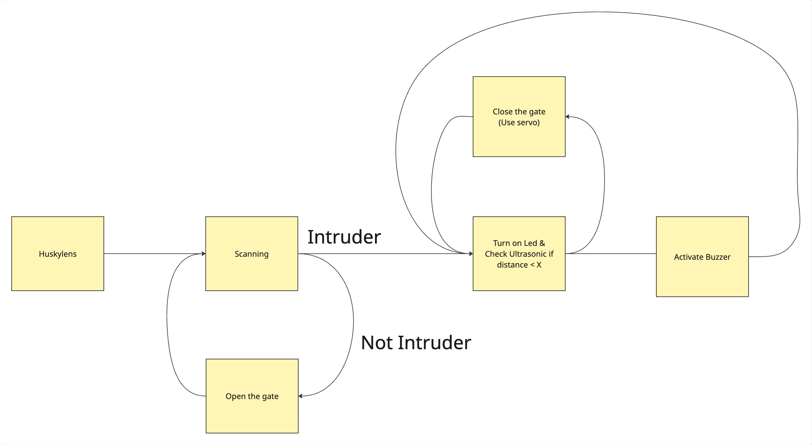

# AI-Enhanced Intrusion Detection System

This project is an Arduino-based security prototype that integrates AI vision with ultrasonic distance sensing to detect and alert on potential intruders.

## Project Structure
- `Prototype`: Contains the main Arduino source code.
- `FlowC.pdf`: Detailed logic flowchart for the system.

## Techniques and Technologies Used

### Hardware Components
- **Microcontroller**: **Arduino Uno R3**.
- **AI Vision**: **HuskyLens** (AI Camera) used for object tracking and identification.
- **Distance Sensing**: **Ultrasonic Sensor (HC-SR04)** for measuring proximity.
- **Actuators**:
  - **Servo Motor**: Directs the camera or a barrier based on detection.
  - **Piezo Buzzer**: Audible alert for close-range detection.
  - **LED Indicator**: Visual status signal.
- **Display**: **I2C LCD (16x2)** for real-time status updates (e.g., "Scanning...", "Intruder!").

### Key Libraries
- `LiquidCrystal_I2C.h`: For LCD control.
- `HUSKYLENS.h`: For AI vision processing.
- `Servo.h`: For motor control.
- `Wire.h`: For I2C communication.

### Logic and Features
1. **Object Tracking**: The HuskyLens is configured for `ALGORITHM_OBJECT_TRACKING` to identify and follow specific targets.
2. **Proximity Validation**: The system uses the ultrasonic sensor to measure distance. An alert is only triggered if an object is detected within a certain threshold (`hypothesis_distance`).
3. **Dynamic Feedback**: 
   - Displays "Intruder!" on the LCD when a learned object is recognized.
   - Activates the buzzer and LED if the intruder is too close.
   - Provides visual feedback of "Scanning..." or "Not an intruder..." depending on the AI's confidence and distance.
4. **Servo Control**: The servo adjusts its position based on the AI's detection results to track or react to the intruder.

## Advanced AI Integration (Future Scope)
If you wish to upgrade the system using more powerful AI models like **Ultralytics (YOLO)**:
- **Server Hosting**: You must host a dedicated server (e.g., Python/FastAPI or Flask) to run the AI inference.
- **Connectivity**: A WiFi module (e.g., ESP8266 or ESP32) must be added to the Arduino Uno R3 to enable network communication.
- **API Interaction**: The Arduino will capture/signal events and send them via API requests to the hosted server for complex object detection and classification.

## Flowchart

Refer to [FlowC.pdf](./FlowC.pdf) for the full logic details.

## Contributor
Wayupuk Sommuang 6722782388 

BaromKorn Wannasarnmaytha 6722781497
